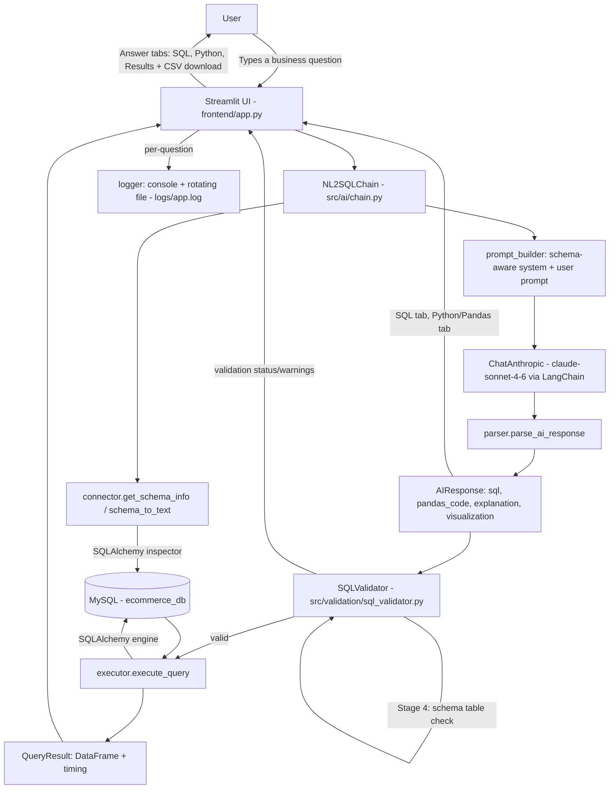

# AI-Powered Natural Language to SQL & Python Code Generator

> **Portfolio Project** | Data Science & Engineering | Dheepak P.L.M.

An end-to-end AI system that converts plain English business questions into
production-quality SQL queries, Python/Pandas code, natural language explanations,
and visualization recommendations — powered by Claude (Anthropic) via LangChain.

---

## Problem Statement

Business users who need answers from a database usually can't write SQL themselves, so every ad-hoc question turns into a request to a data analyst — slow for the user and a constant interruption for the analyst. Even for people who can write SQL, translating a query result into an explanation and a sensible chart is a separate, repetitive step.

## Objective

Let anyone type a business question in plain English and get back, in one step: a validated, safe-to-run SQL query against the live schema, an equivalent Pandas snippet, a plain-English explanation of the query logic, and a chart-type recommendation — with unsafe or malformed SQL caught before it ever reaches the database.

## Solution

A LangChain chain introspects the live MySQL schema, builds a schema-aware prompt, and calls Claude for a structured JSON response (SQL + Pandas code + explanation + visualization recommendation). That SQL is then run through a multi-stage safety validator (keyword blocklist, SELECT-only enforcement, parseability check, schema check) before the app offers to execute it against the database and display results in a Streamlit UI.

---

## Features

- Natural language → SQL query generation (schema-aware)
- Natural language → Pandas DataFrame code generation
- Plain-English explanation of every generated query
- Visualization recommendation (chart type + rationale)
- SQL validation layer (dangerous keyword guard, column checker, parser)
- Live SQL execution against MySQL with paginated results
- Query history with session-level persistence
- Structured logging and error reporting
- Modular, testable architecture

---

## Architecture



Source: [`architecture/architecture.mmd`](architecture/architecture.mmd)

---

## Tech Stack

| Layer | Technology |
|-------|-----------|
| Frontend | Streamlit |
| AI Engine | LangChain + Anthropic Claude (claude-sonnet-4-6) |
| Database | MySQL 8+ |
| Validation | `sqlparse` + custom guard layer |
| Data manipulation | Pandas, SQLAlchemy |
| Config | `python-dotenv` |
| Testing | `pytest` |
| Logging | Python `logging` + rotating file handler |

---

## Project Structure

```
nl2sql/
├── README.md
├── requirements.txt
├── .env.example
├── config/
│   └── settings.py            # Centralised config via env vars
├── data/
│   ├── schema.sql             # Sample database DDL (e-commerce dataset)
│   └── seed_data.sql          # 500+ rows of realistic seed data
├── src/
│   ├── ai/
│   │   ├── __init__.py
│   │   ├── prompt_builder.py  # Schema-aware prompt construction
│   │   ├── chain.py           # LangChain chain definition
│   │   └── parser.py          # Structured output parser
│   ├── db/
│   │   ├── __init__.py
│   │   ├── connector.py       # SQLAlchemy MySQL connection pool
│   │   └── executor.py        # Query execution + result formatting
│   ├── validation/
│   │   ├── __init__.py
│   │   └── sql_validator.py   # SQL safety + schema validation
│   └── utils/
│       ├── __init__.py
│       ├── logger.py          # Logging setup
│       └── helpers.py         # Shared utility functions
├── frontend/
│   └── app.py                 # Streamlit application
└── tests/
    ├── test_validator.py
    ├── test_chain.py
    └── test_executor.py
```

---

## Quick Start

### 1. Clone and set up virtual environment
```bash
git clone <your-repo-url>
cd nl2sql
python -m venv venv
source venv/bin/activate      # Windows: venv\Scripts\activate
pip install -r requirements.txt
```

### 2. Configure environment
```bash
cp .env.example .env
# Edit .env with your credentials
```

### 3. Set up MySQL database
```bash
mysql -u root -p < data/schema.sql
mysql -u root -p ecommerce_db < data/seed_data.sql
```

### 4. Run the application
```bash
streamlit run frontend/app.py
```

---

## Environment Variables (.env)

```
ANTHROPIC_API_KEY=your_key_here
DB_HOST=localhost
DB_PORT=3306
DB_NAME=ecommerce_db
DB_USER=root
DB_PASSWORD=your_password
MAX_ROWS_RETURNED=500
LOG_LEVEL=INFO
```

---

## Sample Questions to Try

- "Show top 10 customers by total revenue"
- "Which product categories have the highest return rates?"
- "Monthly revenue trend for 2024"
- "Average order value by customer segment"
- "Which sales reps closed the most deals last quarter?"
- "List customers who haven't ordered in the last 90 days"
- "What is the revenue split between regions?"

The database seed data to run these against lives in `data/schema.sql` and `data/seed_data.sql` (see Quick Start above).

---

## Sample Output

Not captured here. Producing a real sample output requires a live `ANTHROPIC_API_KEY` and a running MySQL instance loaded with the seed data — neither was available while preparing this documentation, so no output has been fabricated. Once set up, running the question *"Show top 10 customers by total revenue"* through the app will produce a generated SQL query, its Pandas equivalent, an explanation, a chart recommendation, and (if you click **Execute SQL against MySQL**) an actual result table.

## Screenshots

Not available for the same reason as above — see [`screenshots/README.md`](screenshots/README.md) for exactly what to capture once you run the app locally.

---

## Testing

```bash
pytest tests/ -v
pytest tests/ --cov=src --cov-report=html
```

28 tests currently pass, covering SQL validation, AI response parsing, and Pandas code execution — no live API or database connection required for the suite to run.

---

## Evaluation Methodology

The test suite above verifies the deterministic parts of the pipeline (validator, parser, executor) but does not measure whether the AI actually generates *correct* SQL for a given question — that requires live LLM calls and isn't implemented in this repository. See [`evaluation/methodology.md`](evaluation/methodology.md) for a recommended NL2SQL evaluation approach (SQL validity rate, execution success rate, result correctness) and the exact process to run it — clearly marked as **not yet executed**.

## Results

No NL2SQL accuracy results are available (see above — the accuracy evaluation hasn't been run). The 28 unit tests in `tests/` all pass; run `pytest tests/ -v` to reproduce.

## Limitations

- **No end-to-end accuracy evaluation.** Correctness of AI-generated SQL against real questions hasn't been measured (see Evaluation Methodology above).
- **Single-database support.** MySQL only; PostgreSQL/BigQuery/Snowflake are listed under Future Enhancements but not implemented.
- **Session-only history.** Query history lives in Streamlit `session_state` and is lost when the session ends — there's no persistent storage across restarts or users.
- **Sequential, single-user design.** No concurrency handling beyond SQLAlchemy's connection pool; not built for multi-user production load.
- **Pandas execution sandbox is basic.** `execute_pandas_code` runs AI-generated code with `__builtins__` stripped, which blocks obvious misuse but is not a full security sandbox — don't point this at an untrusted multi-tenant deployment without hardening it further.
- **No CI pipeline yet** (listed under Future Enhancements) — tests currently run manually.

---

## Future Enhancements

- [ ] Multi-database support (PostgreSQL, BigQuery, Snowflake)
- [ ] Chart auto-rendering via Plotly
- [ ] Saved query library with tagging
- [ ] Role-based access control (read-only vs admin schemas)
- [ ] Query cost estimator (row scan estimate)
- [ ] Export results to CSV / Excel
- [ ] Slack / Teams bot integration
- [ ] Docker + Docker Compose deployment
- [ ] CI/CD pipeline with GitHub Actions

---

## Interview Discussion Points

- **Why validate SQL after generation instead of trusting the LLM?** LLMs can hallucinate table/column names or occasionally drift toward non-SELECT statements. `SQLValidator` runs a deterministic, testable safety net (keyword blocklist, statement-type check, parseability, schema check) so unsafe or malformed SQL never reaches the database, regardless of what the model outputs.
- **Why is `TEMPERATURE=0.0`?** Code/SQL generation benefits from determinism — the same question should tend to produce the same query, which also makes debugging and evaluation more tractable.
- **Why structured JSON output instead of free-form text?** Parsing a fixed schema (`sql`, `pandas_code`, `explanation`, `visualization`) lets the app reliably split the response across the SQL/Python/Results tabs, and `parser.py` has explicit fallback handling for markdown-fenced or slightly malformed JSON.
- **What would you change before a real production deployment?** Add the NL2SQL accuracy evaluation described in `evaluation/methodology.md`, move query history to persistent storage, add a CI pipeline to run the existing 28 tests on every push, and revisit the Pandas execution sandbox (see Limitations) for a multi-tenant setting.

---

## Author

**Dheepak P.L.M.**  
Post Graduate Program in Data Science & Engineering — Great Lakes Institute of Management  
[LinkedIn](https://linkedin.com/in/dheepakplm-91345030a) | [GitHub](#)
